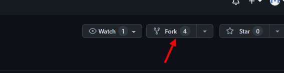

[< к содержанию](/readme.md)

## fork

Функция "fork" позволяет создать свой проект на основе какого-либо другого. Фактически у вас будет полноценная копия проекта от другого разработчика, но в отличии от простой копии, отличается следующими возможностями:

- fork сохраняет связь с первоначальным проектом, что позволяет получать изменения из проекта-родителя
- fork сохраняет связь с первоначальным проектом, что позволяет передавать изменения в проект-родитель 

Создать форк очень просто, на github находим желаемый репозиторий и нажимаем кнопку "Fork"

После нажатия на кнопку, у вас будет собственный репозиторий, в котором можно проводить желаемые изменения и в последствии предлагать эти изменения в проект-родитель, либо получать все изменения из проекта-родителя