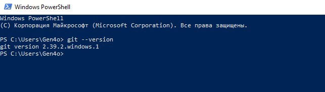

[< к содержанию](/readme.md)

## Установка GIT и первые шаги

Разберем установку GIT на Windows.
Для установки GIT, переходим по [ссылке](https://git-scm.com/download/win), выбираем необходимую версию файла и скачиваем его. После загрузки просто запустите скачанный файл и следуйте инструкциям по установке.

Для проверки, установлен ли GIT на вашем компьютере запустите Windows Power Shell и введите команду
```bash-
git --version
```

Если Git установлен верно, вам отобразится его версия:



С установкой GIT на других операционных системах вы можете ознакомиться на странице [официальной документации](https://git-scm.com/book/ru/v2/Введение-Установка-Git)